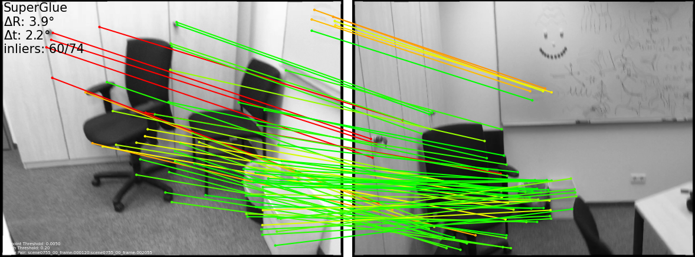

### 研究@Magic Leap

# SuperGlue推理和验证演示脚本

## 介绍
SuperGlue是Magic Leap完成的CVPR 2020研究项目。SuperGlue网络是一种图像神经网络，它与一个最佳匹配层相结合，该层经过训练，可在两组稀疏图像特征上执行匹配。

该报告包括Pytorch代码和预训练权重，用于在SuperPoint关键点和描述符上运行SuperGlue匹配网络。

给定一对图像，您可以使用此repo提取图像对中的匹配特征。

SuperGlue作为“中间端“运行，在单个端到端架构中执行上下文聚合、匹配和过滤。
有关更多详细信息，请参阅：
[SuperPoint](https://arxiv.org/abs/1712.07629) 

SuperGlue：使用图形神经网络学习特征匹配

* 全文PDF: [SuperGlue: Learning Feature Matching with Graph Neural Networks](https://arxiv.org/abs/1911.11763).

* 作者: *Paul-Edouard Sarlin, Daniel DeTone, Tomasz Malisiewicz, Andrew Rabinovich*

* 提供视频、slides、最新更新和更多可视化信息的网站: [psarlin.com/superglue](https://psarlin.com/superglue).

* `hloc`: 用于视觉定位和带有SuperGlue的SfM的新工具箱，可在cvg/Hierarchy localization上获得。 [cvg/Hierarchical-Localization](https://github.com/cvg/Hierarchical-Localization/).
  三届CVPR 2020本地化和图像匹配比赛冠军！

我们提供了两个预训练的权重文件：一个基于ScanNet数据的室内模型，一个基于MegaDepth数据的室外模型。这两个模型都在weights目录中。默认情况下，演示将运行**室内模型**。[weights directory](./models/weights). 

## 依赖关系
* Python 3 >= 3.5
* PyTorch >= 1.1
* OpenCV >= 3.4 (4.1.2.30 建议使用4.1.2.30以实现最佳GUI键盘交互，请参阅[note](#additional-notes))
* Matplotlib >= 3.1
* NumPy >= 1.18

只需运行以下命令: `pip3 install numpy opencv-python torch matplotlib`

## 目录
此repo中有两个主要的top-level脚本

1. `demo_superglue.py` : 在webcam、IP camera、图像目录或电影文件上运行实时演示
2. `match_pairs.py`: 从文件中读取图像对并将匹配转储到磁盘（如果提供了ground truth相对姿态，也会运行评估）

### 实时匹配演示脚本 (`demo_superglue.py`)
此演示在图像和实时图像上运行SuperPoints+SuperGlue功能匹配。您可以按n键更新定位图像。演示可以从USB或IP摄像头、包含图像的目录或视频文件中读取图像流。您可以使用--input标志传递所有这些输入。

### 实时匹配演示脚本

在默认USB webcam（ID #0)上运行演示，如果找到，则在CUDA GPU上运行

```sh
./demo_superglue.py
```

键盘控制:

* `n`: 选择当前帧作为定位点
* `e`/`r`: 增加/减少关键点置信阈值
* `d`/`f`: 增加/减少匹配筛选阈值
* `k`: 切换关键点的可视化
* `q`: 退出

在CPU上运行的320X240映像上运行演示:

```sh
./demo_superglue.py --resize 320 240 --force_cpu
```

 `--resize` 标志可用于以三种方式调整输入图形的大小

1. `--resize` `width` `height` : 调整到精确的宽度X高度尺寸 `width` x `height` dimensions
2. `--resize` `max_dimension` : 将最大输入图像尺寸调整为最大尺寸 `max_dimension`
3. `--resize` `-1` : 不会调整大小 (即使用原始图像尺寸)

默认设置将图像大小调整为 `640x480`.

### 在图像目录上运行演示

 `--input` 标志还接受指向目录的路径。我们提供了一个序列中样本图像的目录。即在headless服务器上的`freiburg_sequence/`图像目录上运行演示（不会显示在屏幕上），并将输入可视化图像写入 `dump_demo_sequence/`:

```sh
./demo_superglue.py --input assets/freiburg_sequence/ --output_dir dump_demo_sequence --resize 320 240 --no_display
```

您应该在示例Freiburg-TUM RGBD序列上看到此输出:


匹配由他们在jet colormap上预测的置信来着色（红色：更置信，蓝色：不置信）

### 其它有用的命令行参数
* 使用`--image_glob` 更改图像文件扩展名 (默认值: `*.png`, `*.jpg`, `*.jpeg`).
* 使用 `--skip` 跳过中间帧 (默认值: `1`).
* 使用 `--max_length` 来限制处理的总帧数 (默认值： `1000000`).
* 使用 `--show_keypoints` 可视化检测到的关键点 (默认值: `False`).

## 运行匹配+评估 (`match_pairs.py`)

此repo还包含一个脚本 `match_pairs.py` ，该脚本从图像对列表中运行匹配。使用此脚本，您可以:

* 在一组图像对上运行matcher (不需要ground truth)
* 根据他们的信息，将关键点和匹配可视化
* 如果提供了ground truth相对姿态和内在特征，则评估并可视化匹配正确性
* 保存关键点、匹配项和评估结果以供进一步处理
* 对多对评估结果进行整理，并生成结果表

### 仅匹配模式

此脚本最简单的用法是处理给定文本文件中列出的图像对，并将关键点和匹配项转储到压缩的numpy `npz`文件中。我们在 `assets/example_indoor_pairs/` 的主要论文中提供了具有挑战性的ScanNet对。运行以下命令将在每个图像对上运行 Super + SuperGlue, 并将结果转储到`dump_match_pairs/`:


```sh
./match_pairs.py
```

生成的 `.npz` 文件可以从Python中读取，如下所示：

```python
>>> import numpy as np
>>> path = 'dump_match_pairs/scene0711_00_frame-001680_scene0711_00_frame-001995_matches.npz'
>>> npz = np.load(path)
>>> npz.files
['keypoints0', 'keypoints1', 'matches', 'match_confidence']
>>> npz['keypoints0'].shape
(382, 2)
>>> npz['keypoints1'].shape
(391, 2)
>>> npz['matches'].shape
(382,)
>>> np.sum(npz['matches']>-1)
115
>>> npz['match_confidence'].shape
(382,)
```

对于 `keypoints0`中的每个关键点, `matches` 数组表示 `keypoints1` 中匹配关键点的索引，如果关键点不匹配，则表示 `-1`.

### 可视化模式

你可以添加标志 `--viz` 以转储图像输出，从而可视化匹配:


```sh
./match_pairs.py --viz
```

你应该在 `dump_match_pairs/` 中看到这样的图像 (或者非常接近它的东西，请参见此 [note](#a-note-on-reproducibility)):


匹配由他们在jet colormap上预测的置信来着色（红色：更置信，蓝色：不置信）

### 验证模式

您还可以使用RANSAC + Essential Matrix decomposit 来估计姿态，并在输入`.txt` 文件中提供了ground truth相对姿态和本质时对其进行评估。每个 `.txt` 文件包含三个关键的基本真值矩阵： img3x3 intrinsics matrix of image0: `K0`, a 3x3 intrinsics matrix of image1: `K1` , and a 4x4 matrix of the relative pose extrinsics `T_0to1`.

在样本图片集上运行验证 (默认读取 `assets/scannet_sample_pairs_with_gt.txt`), 你可以运行:

```sh
./match_pairs.py --eval
```

由于启用了 `--eval`, 您应该可以看到打印到终端上的整理结果。对于提供的示例图像，您应该获得以下数字（或非常接近的数字，请参见此 [note](#a-note-on-reproducibility)):

```txt
Evaluation Results (mean over 15 pairs):
AUC@5    AUC@10  AUC@20  Prec    MScore
26.99    48.40   64.47   73.52   19.60
```

在`dump_match_pairs/`中生成的 `.npz` 文件现在将包含与计算相关的标量值，这些标量值时根据提供的示例图像计算的。以下是您应该在其中一个生成的评估文件中找到的内容:

```python
>>> import numpy as np
>>> path = 'dump_match_pairs/scene0711_00_frame-001680_scene0711_00_frame-001995_evaluation.npz'
>>> npz = np.load(path)
>>> print(npz.files)
['error_t', 'error_R', 'precision', 'matching_score', 'num_correct', 'epipolar_errors']
```

您还可以通过运行以下命令来可视化评估指标:

```sh
./match_pairs.py --eval --viz
```

现在，您还可以看到 `dump_match_pairs/` 中的其它图像，这些图像显示了评估数字（或非常接近评估数字的图像，请参见此[note](#a-note-on-reproducibility)):



图像的左上角显示了姿态误差和内射线的数量，而这些线是由它们的极线误差（使用基本事实相对姿态计算得出）着色的（红色：较高误差，绿色：较低误差）

### 在样本室外对上运行


在本repo中, 我们还提供了一些具有挑战性的Phototourism对, 以便您可以重新创建论文中的一些数字。运行此脚本以在提供的对上运行匹配和可视化（未提供ground truth，请参阅 [note](#reproducing-outdoor-evaluation-final-table)) on the provided pairs:

```sh
./match_pairs.py --resize 1600 --superglue outdoor --max_keypoints 2048 --nms_radius 3  --resize_float --input_dir assets/phototourism_sample_images/ --input_pairs assets/phototourism_sample_pairs.txt --output_dir dump_match_pairs_outdoor --viz
```

您现在应该可以在 `dump_match_pairs_outdoor/` (或者非常接近它的东西，请参见此 [note](#a-note-on-reproducibility)) 中对这些图像进行成像:


### 室内/室外的推荐设置


对于 **室内** 图像，我们建议使用以下设置（这些是默认设置）:

```sh
./match_pairs.py --resize 640 --superglue indoor --max_keypoints 1024 --nms_radius 4
```

对于 **室外** 图像, 我们建议使用以下设置:

```sh
./match_pairs.py --resize 1600 --superglue outdoor --max_keypoints 2048 --nms_radius 3 --resize_float
```

您可以为包含在 `--input_pairs` 中的图像提供自己的对列表 `--input_dir`. 在网络推断之前，可以使用 `--resize`调整图像的大小. 如果多次运行相同的计算，可以使用 `--cache` 标志重用旧计算。

### 测试集对文件格式解释

我们提供了 `assets/scannet_test_pairs_with_gt.txt` (带基本事实) 和Phototourism测试对 `assets/phototourism_test_pairs.txt` (不带基本事实) 中的ScanNet测试对列表，用于评估论文中的匹配。每行对应一对，结构如下:

```
path_image_A path_image_B exif_rotationA exif_rotationB [KA_0 ... KA_8] [KB_0 ... KB_8] [T_AB_0 ... T_AB_15]
```

 `path_image_A` 和 `path_image_B` 目录分别是指向图像A和B的路径。`exif_rotation`是范围[0,3]内的整数，该范围来自与图像关联的原始EXIF元数据，其中，0: 不旋转, 1: 顺时针90度, 2: 顺时针180度, 3: 顺时针270度。
 如果EXIF数据未知，您可以在此处提供零，并且不会执行旋转。 `KA` 和 `KB` 是图像A和图像B内部函数的平坦的 `3x3`矩阵， `T_AB`是一对外部变量之间的平坦的 `4x4` 矩阵.

### 在ScanNet上再现室内评估

为了方便起见，我们以 `assets/scannet_test_pairs_with_gt.txt` 文件的格式提供了ScanNet的基本信息。
为了重现与本文中类似的表格，您需要下载数据集（我们不提供原始测试图像）。要下载ScanNet数据集，请执行以下操作:

1. 前往 [ScanNet](https://github.com/ScanNet/ScanNet) github repo 下载ScanNet测试集 (100个场景).
2. 您需要使用[SensReader](https://github.com/ScanNet/ScanNet/tree/master/SensReader)从测试集中每个场景的100 `.sens` 文件中提取原始传感器数据.

在 `~/data/scannet` 中下载ScanNet数据集后，可以运行以下操作:

```sh
./match_pairs.py --input_dir ~/data/scannet --input_pairs assets/scannet_test_pairs_with_gt.txt --output_dir dump_scannet_test_results --eval
```

对于ScanNet，您应该获得下表（或与之非常接近的内容，请参见 [note](#a-note-on-reproducibility)):

```txt
Evaluation Results (mean over 1500 pairs):
AUC@5    AUC@10  AUC@20  Prec    MScore
16.12    33.76   51.79   84.37   31.14
```


### 再现YFCC的室外评估

为了方便起见，我们在 `assets/yfcc_test_pairs_with_gt.txt` 文件中以我们的格式提供了YFCC的ground truth。
为了重现与本文中类似的表格，您需要下载数据集（我们不提供原始测试图像）。
要下载YFCC数据集，可以使用 [OANet](https://github.com/zjhthu/OANet) repo:

```sh
git clone https://github.com/zjhthu/OANet
cd OANet
bash download_data.sh raw_data raw_data_yfcc.tar.gz 0 8
tar -xvf raw_data_yfcc.tar.gz
mv raw_data/yfcc100m ~/data
```

在 `~/data/yfcc100m` 下载YFCC数据集后，可以运行以下操作:

```sh
./match_pairs.py --input_dir ~/data/yfcc100m --input_pairs assets/yfcc_test_pairs_with_gt.txt --output_dir dump_yfcc_test_results --eval --resize 1600 --superglue outdoor --max_keypoints 2048 --nms_radius 3 --resize_float
```

关于YFCC，您应该获得下表（或与之非常接近的内容，请参见此 [note](#a-note-on-reproducibility)):

```txt
Evaluation Results (mean over 4000 pairs):
AUC@5    AUC@10  AUC@20  Prec    MScore
39.02    59.51   75.72   98.72   23.61  
```

### 再现室外Phototourism评估

本文中显示的Phototourism是使用与 [Image Matching Challenge 2020](https://vision.uvic.ca/image-matching-challenge/) 中的测试集类似的数据生成的，它为测试集保存私有的基本事实。
我们列出了在 `assets/phototourism_test_pairs.txt`中使用的对。
若要在此测试集中重现类似的数字，请提交challenge benchmark。
虽然挑战仍然存在，但我们不能公开共享测试集，因为我们希望帮助维护挑战的完整性。 


### 修正 YFCC 和 Phototourism 中的EXIF旋转数据


在本repo中, 我们为YFCC和Phototourism的室外评估提供手动校正的EXIF旋转数据。
对于YFCC数据集，我们发现7幅图像的EXIF旋转的标志不正确，导致4000对图像中有148对被纠正。
对于Phototourism，我们发现36幅图像的EXIF旋转标志不正确，导致220对图像中的212对被纠正。

SuperGlue paper报告SuperGlue的结果，没有纠正的旋转，而本README文件中的数字报告有纠正的旋转。
我们发现，无论旋转是否正确，评估得出的最终结论仍然有效。
为了向后兼容，我们将原始、未修正的EXIF旋转数据分别保存在 `assets/phototourism_test_pairs_original.txt` 和 `assets/yfcc_test_pairs_with_gt_original.txt` 中.


### MegaDepth室外训练/验证场景分割


为了训练和验证室外模型，我们使用了[MegaDepth dataset](http://www.cs.cornell.edu/projects/megadepth/)中的场景。 
我们在 `assets/` 目录中提供用于训练户外模型的场景列表:

* 训练集: `assets/megadepth_train_scenes.txt`
* 验证集: `assets/megadepth_validation_scenes.txt`


### 关于再现性的note


在简化模型代码和评估代码并准备发布之后，我们进行了一些改进和调整，结果得到的数字与本文中报告的略有不同。
README文件中报告的数字和数字是使用Ubuntu 16.04、OpenCV 3.4.5和PyTorch 1.1.0完成的。
即使与库版本相匹配，我们也观察到Mac和Ubuntu之间存在一些细微的差异，我们认为只是由于OpenCV的图像调整功能实现和RANSAC的随机性不同所致。

### 使用--fast_viz创建高质量的PDF可视化和更快的可视化 


使用 `match_pairs.py` 生成输出图像时，默认的 `--viz` 标志使用 Matplotlib renderer。
如果您另外使用 `--viz_extension pdf` 而不是默认的PNG扩展名，则可以生成相机就绪的PDF可视化.

```
./match_pairs.py --viz --viz_extension pdf
```

或者，您可能希望保存可视化图像，但生成速度要快得多。您可以使用 `--fast_viz` 标志使用基于OpenCV的图像渲染器，如下所示:

```
./match_pairs.py --viz --fast_viz
```

如果您还希望OpenCV显示窗口预览结果 (或者使用非PDF输出和fast_fiz), 只需要运行：

```
./match_pairs.py --viz --fast_viz --opencv_display
```


## BibTeX引文
如果您使用本文件中的任何想法或代码，请考虑引用:

```txt
@inproceedings{sarlin20superglue,
  author    = {Paul-Edouard Sarlin and
               Daniel DeTone and
               Tomasz Malisiewicz and
               Andrew Rabinovich},
  title     = {{SuperGlue}: Learning Feature Matching with Graph Neural Networks},
  booktitle = {CVPR},
  year      = {2020},
  url       = {https://arxiv.org/abs/1911.11763}
}
```

## 附加说明
* 在demo中, 我们发现键盘交户与OpenCV 4.1.2.30配合得很好，较旧的版本响应性较差，最新的版本有一个 [OpenCV bug on Mac](https://stackoverflow.com/questions/60032540/opencv-cv2-imshow-is-not-working-because-of-the-qt)
* 我们通常不建议在160X120分辨率 (QQVGA) 以下和2000x1500以上运行SuperPoint+SuperGlue
* 我们不打算发布SuperGlue训练代码.
* 我们不打算发布基于SIFT或单应性的SuperGlue模型.

## Legal Disclaimer
Magic Leap is proud to provide its latest samples, toolkits, and research projects on Github to foster development and gather feedback from the spatial computing community. Use of the resources within this repo is subject to (a) the license(s) included herein, or (b) if no license is included, Magic Leap's [Developer Agreement](https://id.magicleap.com/terms/developer), which is available on our [Developer Portal](https://developer.magicleap.com/).
If you need more, just ask on the [forums](https://forum.magicleap.com/hc/en-us/community/topics)!
We're thrilled to be part of a well-meaning, friendly and welcoming community of millions.
